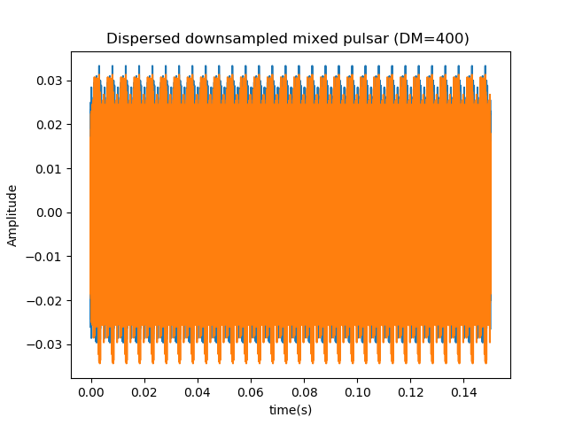
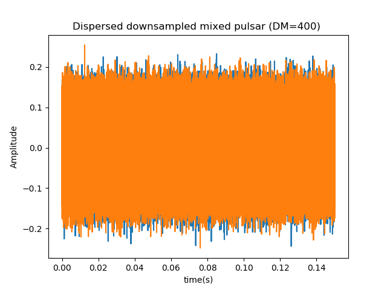
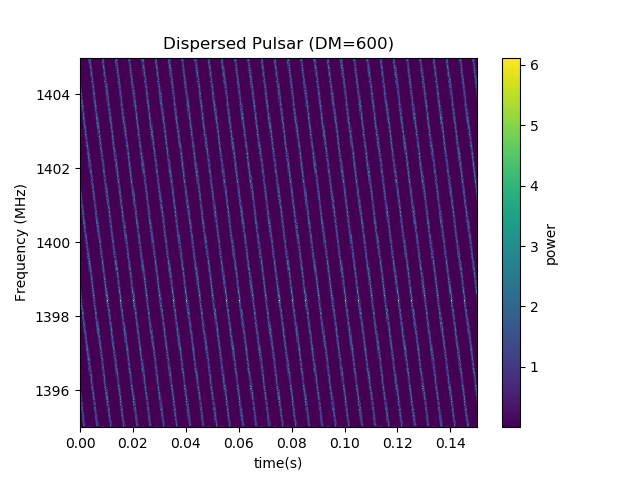
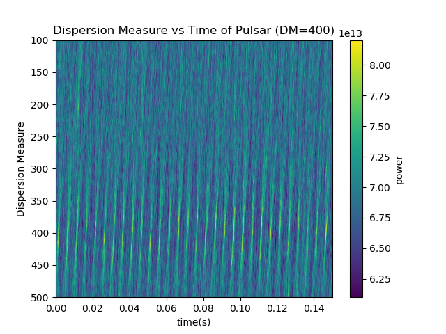
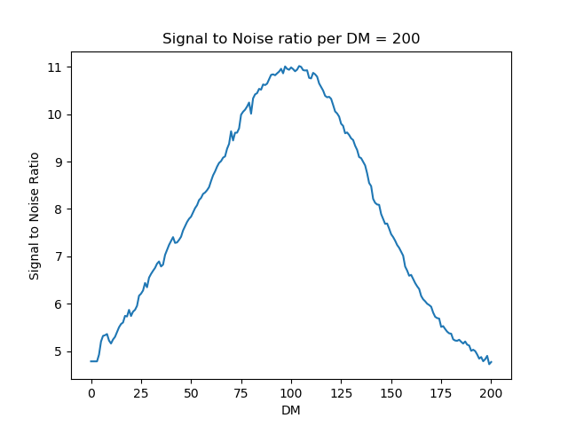

# Documentation

## List of Documents:

Note that the detailed documentation of the python pipeline is not located in the readme file under jupyter. The theory will be located there as well

The dedispersed png files such as  show the pulsar after it has been dedispersed.

The dispersed files after this include the dispersed pulsar with noise and without noise. The without noise looks like a dispersed pulse train , while the train with noise looks like .

The waterfall plots that have the diserpsed pulsar on look like . This is what the pulsar looks like after the FFT and integration are done.

The dispersion measure files show the pulsar after it has been dediseprsed and the frequencies for each DM have been summed together. They look like  when noise is added to the signal. The bow ties are barely visible, which indicates this is on the upper end of where the pulse can be detected.

Finally, the SNR plots show the signal to noise ratio of each DM. a graph such as  shows that a pulsar has been identified between the range of DMs where the SNRis greater than ten.
